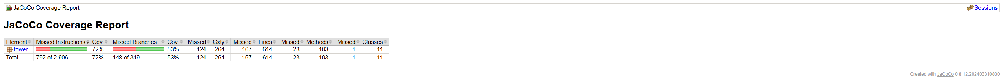
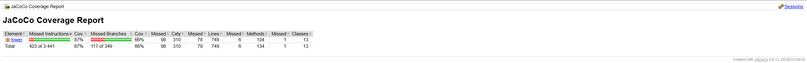
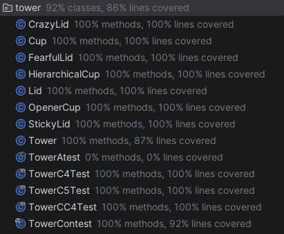

# Stacking Items - Proyecto DOPO

## Descripción

Simulador del problema **Stacking Cups** (Problem J - Maratón Internacional de Programación ICPC 2025).  
Permite apilar tazas y tapas de diferentes tipos en una torre, visualizando el resultado gráficamente.

---

## Autores

| Nombre | Rol |
|--------|-----|
| **Nicolás Prieto** | Desarrollador |
| **Sebastian Peña** | Desarrollador |

Escuela Colombiana de Ingeniería Julio Garavito  
Desarrollo Orientado por Objetos (DOPO/POOB) — 2026-1

---

## Tipos de Elementos

### Tazas

| Tipo | Color | Comportamiento |
|------|-------|----------------|
| `normal` | Rojo/Verde/Amarillo/Azul/Magenta | Comportamiento estándar |
| `opener` | Naranja | Al entrar, elimina **todas** las tapas de la torre |
| `hierarchical` | Cyan | Desplaza tazas de menor número; si llega al fondo no se puede remover |

### Tapas

| Tipo | Color | Comportamiento |
|------|-------|----------------|
| `normal` | Negro | Comportamiento estándar |
| `fearful` | Rosa | No entra si su taza no está en la torre; no sale si está tapando su taza |
| `crazy` | Verde | Se ubica en la **base** de la torre en lugar de tapar su taza |
| `sticky` (hecha por nosotros) | Magenta | Al ser removida, se adhiere a la siguiente taza disponible |

---

## Análisis Dinámico (JaCoCo)

### Resultado Inicial — Ciclo 4

Pruebas ejecutadas: **26/26 ✅**  
Cobertura de código de dominio: **69.7%**

| Clase | Cobertura |
|-------|-----------|
| Tower | 69.6% |
| Cup | 71.8% |
| Lid | 46.8% |
| OpenerCup | 100% |
| HierarchicalCup | 100% |
| FearfulLid | 77.8% |
| CrazyLid | 77.8% |
| StickyLid | 77.8% |
| **Total dominio** | **69.7%** |

**Decisiones tomadas tras el resultado inicial:**
- `Lid` tiene solo 46.8% — se agregarán pruebas para `setPosition`, `setSize`, `setColor` y `makeVisible/makeInvisible`
- `Tower` tiene 69.6% — se agregarán pruebas para `reverseTower`, `removeLid`, `cover` con múltiples tapas y casos borde de `swapToReduce`
- `Cup` tiene 71.8% — se agregarán pruebas para `getXPos`, `getYPos` y `getWidth`
- Meta ciclo 5: superar **75%** de cobertura

### Resultado Final — Ciclo 5

Pruebas ejecutadas: **52/52 ✅**  
Cobertura de código de dominio: **91.1%**

| Clase | Inicial | Final |
|-------|---------|-------|
| Tower | 69.6% | 88.9% |
| Cup | 71.8% | 100% |
| Lid | 46.8% | 100% |
| OpenerCup | 100% | 100% |
| HierarchicalCup | 100% | 100% |
| FearfulLid | 77.8% | 100% |
| CrazyLid | 77.8% | 100% |
| StickyLid | 77.8% | 100% |
| TowerContest | — | 93.3% |
| **Total dominio** | **69.7%** | **91.1%** |

**Decisiones tomadas para mejorar la cobertura:**
- Se agregaron pruebas para `Lid.setPosition`, `setSize`, `setColor`, `makeVisible` y `makeInvisible` → subió de 46.8% a 100%
- Se agregaron pruebas para `Cup.getXPos`, `getYPos`, `getWidth`, `makeVisible` y `makeInvisible` → subió de 71.8% a 100%
- Se agregaron pruebas para `Tower.reverseTower`, `removeLid`, `cover` con múltiples tapas, `popCup` vacía y `popLid` sin tapa
- Se agregaron pruebas para `TowerContest.simulate` con casos posible, imposible y altura grande
- Meta superada: **91.1% > 75%** ✅

---

## Análisis Estático (PMD)

### Resultado Inicial — Ciclo 4

Violaciones encontradas: **77**

| Archivo | Violaciones | Reglas principales |
|---------|-------------|-------------------|
| Tower.java | 55 | ControlStatementBraces, LiteralsFirstInComparisons, ReturnEmptyCollectionRatherThanNull |
| TowerContest.java | 8 | UseUtilityClass, NonThreadSafeSingleton, ControlStatementBraces |
| Canvas.java | 14 | UnnecessaryImport, ControlStatementBraces, EmptyCatchBlock |

**Decisiones tomadas:**
- Se agregaron llaves `{}` a todos los `if/for/else` de una sola línea
- Se invirtieron comparaciones: `"valor".equals(variable)` en lugar de `variable.equals("valor")`
- `swapToReduce()` retorna arreglo vacío en lugar de `null`
- `TowerContest` se hizo `final` con constructor privado
- `currentTower` se hizo `volatile`
- `Canvas` usa imports específicos y maneja `InterruptedException` correctamente

### Resultado Final — Ciclo 5

Violaciones restantes: **4** (todas de baja prioridad)

| Archivo | Violaciones | Regla |
|---------|-------------|-------|
| Canvas.java | 2 | ClassWithOnlyPrivateConstructorsShouldBeFinal (clases internas) |
| Tower.java | 0 | Todas resueltas |
| TowerContest.java | 0 | Todas resueltas |

---

## Pruebas

| Clase | Tipo | Cantidad |
|-------|------|----------|
| `TowerC2Test` | Unitarias ciclo 2 | 8 pruebas |
| `TowerC4Test` | Unitarias ciclo 4 | 14 pruebas |
| `TowerCC4Test` | Comunes ciclo 4 | 12 pruebas |
| `TowerAtest` | Aceptación ciclo 4 | 2 pruebas |
| `TowerC5Test` | Unitarias ciclo 5 | 26 pruebas |
| `TowerContestTest` | Unitarias TowerContest | 9 pruebas |
| `TowerContestCTest` | Comunes TowerContest | 12 pruebas |

---

## Retrospectivas

### Ciclo 5

**1. ¿Qué hicimos bien?**  
Logramos superar ampliamente la meta de cobertura (91.1% vs 75% requerido). El análisis PMD redujo las violaciones de 77 a 4.

**2. ¿Qué no hicimos bien?**  
No habíamos cubierto suficientemente `Lid` y `Cup` en ciclos anteriores, lo que requería trabajo adicional en el cierre.

**3. ¿Qué debemos mejorar?**  
Escribir pruebas en paralelo con el código desde el inicio, no al final.

**4. ¿Qué aprendimos?**  
El uso de JaCoCo para identificar exactamente qué líneas no están cubiertas es muy valioso. PMD ayuda a mantener el código limpio y consistente.

**5. ¿Qué obstáculos encontramos?**  
JaCoCo 0.8.12 CLI no soporta Java 24 (class version 68), tuvimos que compilar con target Java 11 para generar el reporte.

**6. ¿Cómo resolvimos los obstáculos?**  
Usando el flag `--release 11` en javac para generar bytecode compatible con JaCoCo.

**7. ¿Qué tan satisfechos estamos?**  
Muy satisfechos. El proyecto quedó bien estructurado, con alta cobertura y listo para IntelliJ.

---

### Ciclo 4

**1. ¿Qué hicimos bien?**  
Estructuramos el proyecto en dos paquetes aplicando herencia con `ShapeBase`. Los nuevos tipos quedaron visualmente distinguibles y con comportamientos bien definidos.

**2. ¿Qué no hicimos bien?**  
No teníamos claro desde el inicio cómo manejar la lógica de `HierarchicalCup` dentro de `Tower` sin romper encapsulación.

**3. ¿Qué debemos mejorar?**  
Diseñar el diagrama de clases completo antes de codificar.

**4. ¿Qué aprendimos?**  
Uso efectivo de herencia y diseño de subclases con comportamientos polimórficos. Importancia del diagrama de paquetes.

**5. ¿Qué obstáculos encontramos?**  
Conflicto de nombres entre `shapes.Shape` y `java.awt.Shape`. Integración entre paquetes en BlueJ requirió nombres completamente calificados.

**6. ¿Cómo resolvimos los obstáculos?**  
Renombramos la clase abstracta a `ShapeBase` y usamos `shapes.Rectangle` con nombre calificado en el paquete `tower`.

**7. ¿Qué tan satisfechos estamos?**  
Bastante satisfechos. 26/26 pruebas en verde y comportamientos visualmente distinguibles.

**8. ¿Qué haríamos diferente?**  
Diseñar el diagrama de paquetes completo desde el inicio y proponer el nuevo tipo desde el diseño, no al final.

---

### Ciclo 3

**1. ¿Qué hicimos bien?** Implementamos `TowerContest` con `solve()` y `simulate()` correctamente cubriendo todos los casos del problema de maratón.  
**2. ¿Qué no hicimos bien?** Las pruebas iniciales tenían casos incorrectos que tuvimos que corregir en commits posteriores.  
**3. ¿Qué debemos mejorar?** Verificar los casos de prueba contra el enunciado antes de hacer commit.  
**4. ¿Qué aprendimos?** A separar la lógica de resolución de la lógica de simulación visual.  
**5. ¿Qué obstáculos encontramos?** Calcular los anchos proporcionalmente para que la simulación se vea bien en el canvas.  
**6. ¿Cómo resolvimos?** Escalando el ancho máximo disponible proporcionalmente al número de tazas.  
**7. ¿Qué tan satisfechos estamos?** Satisfechos con la solución del problema de maratón.  
**8. ¿Qué haríamos diferente?** Escribir las pruebas antes del código (TDD).

---

### Ciclo 2

**1. ¿Qué hicimos bien?** Implementamos `swap`, `cover` y `swapToReduce` exitosamente con pruebas completas.  
**2. ¿Qué no hicimos bien?** El posicionamiento visual con `updatePositions` fue difícil de depurar.  
**3. ¿Qué debemos mejorar?** Documentar mejor los métodos desde el inicio del ciclo.  
**4. ¿Qué aprendimos?** Manejo de listas de objetos heterogéneos con `instanceof`.  
**5. ¿Qué obstáculos encontramos?** `updatePositions` requirió múltiples iteraciones para funcionar correctamente.  
**6. ¿Cómo resolvimos?** Usando índices de slot y calculando posiciones relativas con deltas.  
**7. ¿Qué tan satisfechos estamos?** Satisfechos con la funcionalidad lograda.  
**8. ¿Qué haríamos diferente?** Aplicar TDD desde el inicio del proyecto.

---

## Requisitos

- Java 11+
- BlueJ 5.x (ciclos 1-4) / IntelliJ IDEA (ciclo 5)
- JUnit 4.12
- JaCoCo 0.8.12 (análisis de cobertura)
- PMD 7.0.0 (análisis estático)

---

## Cobertura en IntelliJ

Cobertura final en IntelliJ IDEA: **92% clases, 86% líneas**
